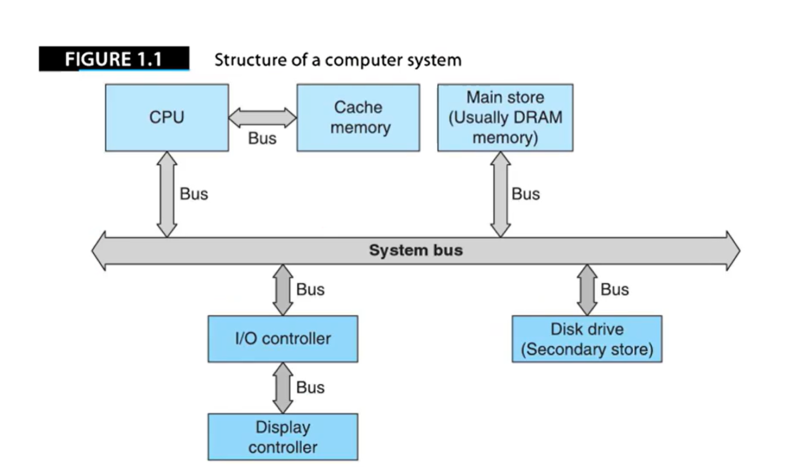
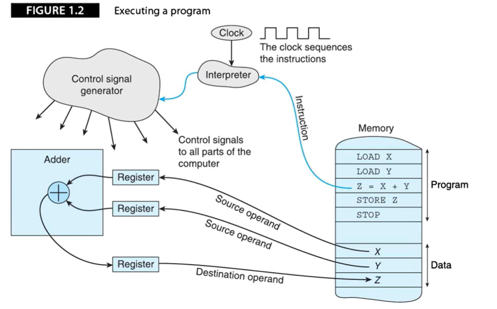

# 1.1 什么是计算机体系结构


- 计算机系统包括：
  - 中央处理单元CPU：读取、执行程序
  - 存储器：保存程序和数据
  - IO子系统：显示器、鼠标、键盘

- 处理器（CPU）是实际执行程序的组件；微处理器实在单个硅片上实现的CPU，微处理器构建的计算机叫微机。

- 计算机性能不仅取决于CPU也取决于其他子系统性能，若不能高效数据传输，仅仅提高CPU性能无意义。


## 简单通用计算机结构


一个简易的计算机结构如下：



- 信息（程序Program、数据Data）保存在存储器中，为实现不同目标，计算机会使用不同类型的存储器（Cache、主存、辅存等）。
- Cache（高速缓存）存储常用信息，主存存储大量工作信息，辅存（磁盘、CD-ROM）存储海量信息。
- 计算机各个子系统通过总线（Bus）连接在一起，数据通过总线从计算机中一个位置传递到另一个位置。


下图描述了一台接收并处理输入信息、产生输出结构的可编程数字计算机：


可编程计算机接收两种类型的输入：

1. 要处理的数据（Data）
2. 定义处理数据的程序（Program）


数字计算机结构可分为两部分：

1. 中央处理单元（CPU）：读取程序完成指定操作
2. 存储器系统：保存程序与程序处理、产生的数据

另外，寄存器（Register）是CPU内部用来存放数据的存储单元；时钟（Clock）提供了脉冲流，所有内部操作都在时钟脉冲的触发下进行。时钟频率是决定计算机速度的一个因素。（CPU主频）


## 程序的执行过程


程序的执行过程如下：




```cpp
while(0) {
    ifetch();	// 取指令
    decode();	// 解码
    exec();		// 执行
}
```


## 计算机基本指令

六条基本指令：

```assembly
MOV A, B	; 将B的值复制到A
LOAD A, B	; 将存储单元B的值复制到寄存器A
STORE A, B	; 将寄存器B的值复制到存储单元A
ADD A, B	; A与B相加，结果保存到A
TEST A		; 测试A的值是否为0
BEQ Z		; 若最后一次测试结果为TRUE，执行Z处代码，否则继续执行
```

