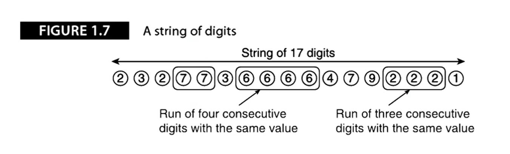

# 1.4 存储程序计算机

## 问题描述

十进制数串23277366664792221，其中有一些值相通的数字连续出现（如连续的2个7，4个6和3个2），我们的问题十分简单：找出**最大游程**，即同一个数字连续出现的最大次数。

为了简化问题，假设数串长度大于3，设计一个计算机来处理数串，每次读一个数并计算最大游程：

从数串的左边逐个检查数字，在任何一个位置，都会得到两个结果之一：要么这个数和前一个相同，序列还在增长；要么这个数与上一个不同，前一个序列结束，一个新的序列开始。