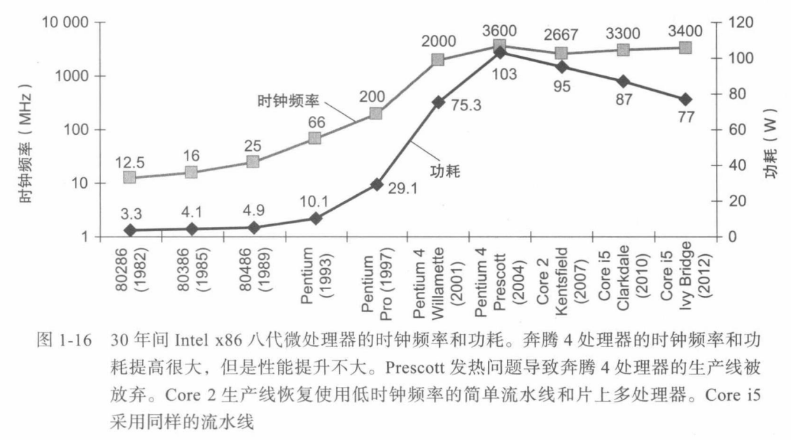
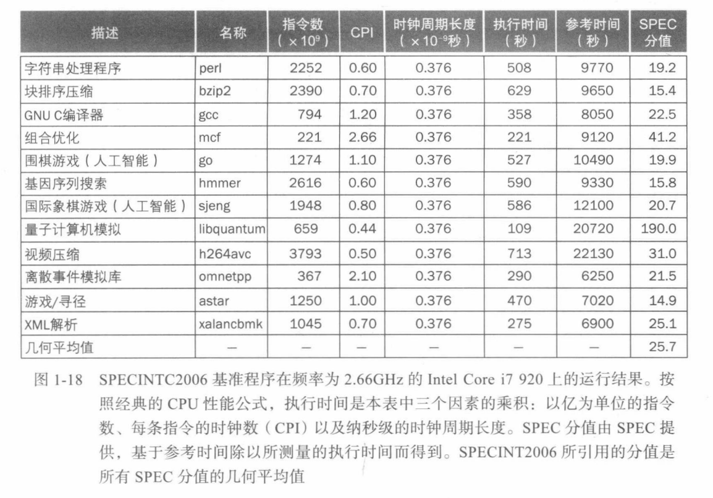
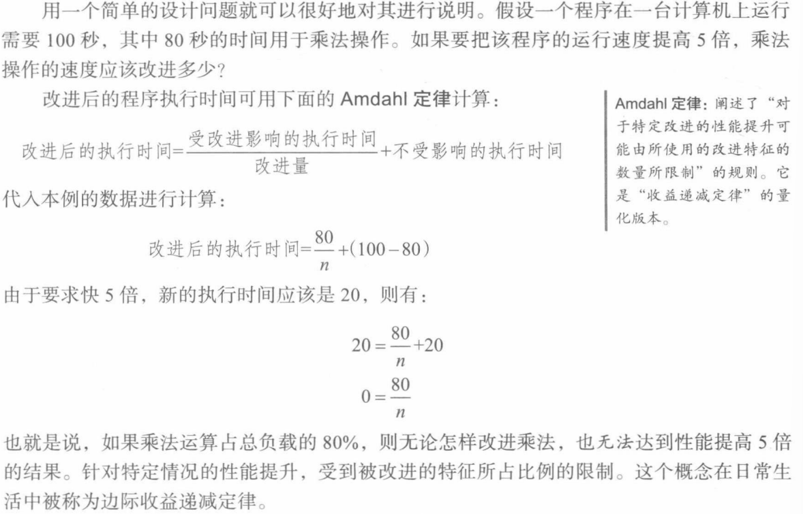
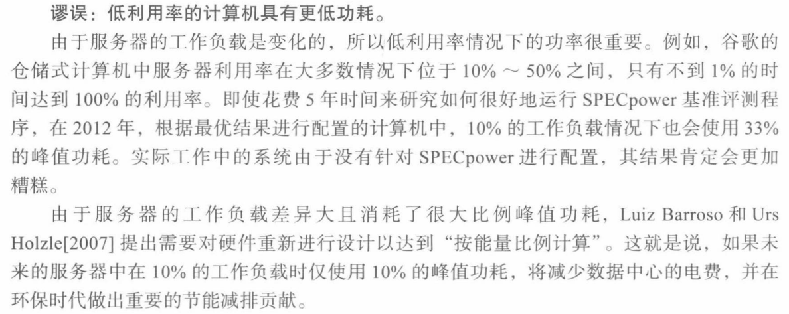
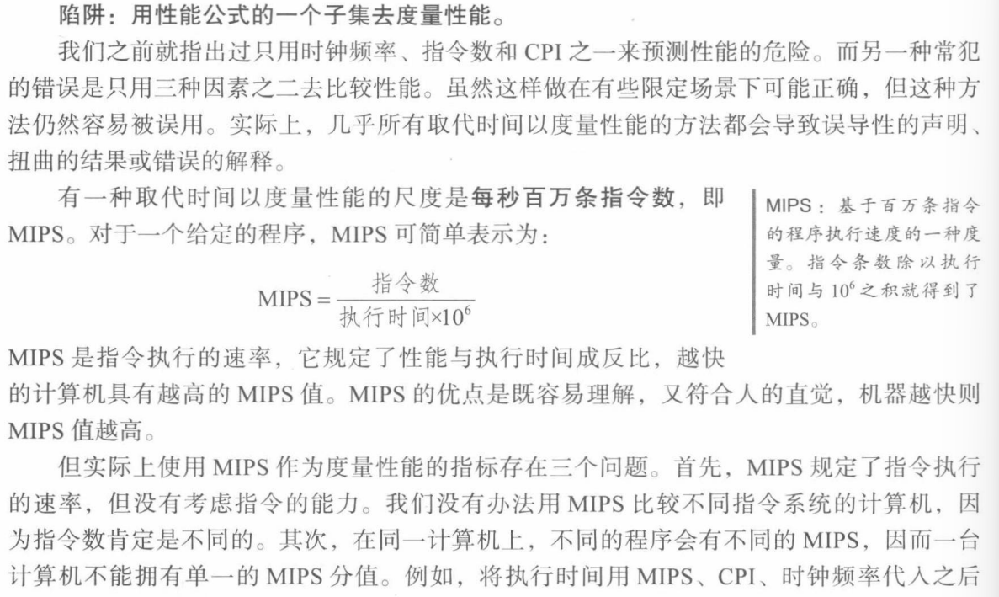

# 性能


## 性能指标


**CPU执行时间**（*CPU exec time*）：也称**CPU时间**，执行某一任务在CPU上花费的时间。

**用户CPU时间**（*User time*）：程序本身所花费的CPU时间。

**系统CPU时间**（*System time*）：为执行程序花费在操作系统上的时间。

**时钟周期长度**（*Cycle length*）：每个时钟周期持续的时间，**时钟频率**（*Clock Frequency*）的倒数。

**时钟周期数**（*CPU cycle*）：处理器时钟在固定频率下运行。

```python
CPU_exec_time = CPU_cycles * Cycle_length
```

**指令数**（*Number of instructions*）：程序执行所需要的指令总数。

**指令平均时钟周期数**（*CPI*）：平均每个指令所需要的时钟周期。

```
CPU_exec_time = N_insts * CPI * Cycle_length
```

**每秒百万条指令数**（*MIPS*）：程序速度的一种度量。（无法用 MIPS 比较不同 ISA 的计算机；其次，一台计算机上不同程序也有不同的 MIPS）

```python
MIPS = N_insts / (exec_time * 10^6) = Clock_frequency / (CPI * 10^6)
```


**[例] 代码片段比较**：请问哪个代码序列执行的指令数更多？哪个执行速度更快？每个代码序列 CPI 分别是多少？

每列指令的 CPI：

| 指令类别 |  A   |  B   |  C   |
| :------: | :--: | :--: | :--: |
|   CPI    |  1   |  2   |  3   |

两段代码序列所需指令数量分别如下：

| 指令类别 |  A   |  B   |  B   |
| :------: | :--: | :--: | :--: |
|  序列1   |  2   |  1   |  2   |
|  序列2   |  4   |  1   |  1   |

答：序列1共执行 2+1+2=5 条指令，序列2共执行 4+1+1=6 条指令。

```python
CPI_1 = (2*1 + 1*2 + 2*3) / 5 = 2.0
CPI_2 = (4*1 + 1*2 + 1*3) / 6 = 1.5
```


## 功耗墙





## SPEC CPU 基准评测





## 谬误 & 陷阱


1. **谬误1：**期望总性能与改进大小成正比




2. **谬误2**




3. **谬误3**


4. **陷阱1**

