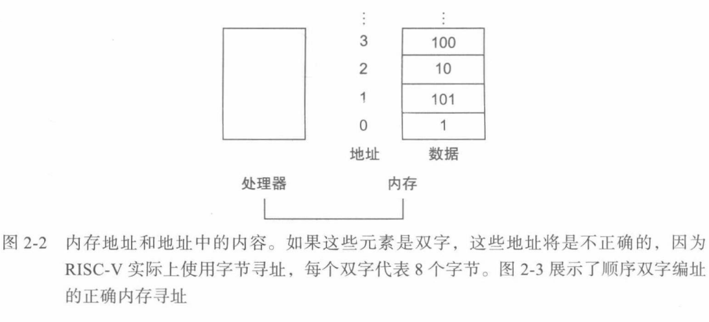

# 指令系统


## 操作数

**指令操作数**（*Oprand*）：与高级语言不同，算术指令操作数会受到限制————必须取自寄存器（*Register*），寄存器数量有限并内建于硬件。

**双字**（*Double Word*）：一般为 64 位，对应于 RISC-V 中寄存器大小，8个字节。

**字**（*Word*）：一般为 32 位，4个字节。

**寄存器**（*Register*）：限制32个。

>**设计原则2：更少则更快**
>
>数量过多的寄存器可能会增加时钟周期，电信号传输的距离越远，所花费的时间越长。


## 数据传输指令

**数据传输指令**：在内存和寄存器之间传送数据的命令。

**地址**（*Address*）：用于描述内存数组中特定数据元素位置的值。



载入指令（Load）：将数据从内存复制到寄存器。

```cpp
g = h + A[8];
// x20 <- g
// x21 <- h
// x22 <- address of A[]
```

编译后：

```assembly
ld  x9, 8(x22)		// 临时寄存器 x9 得到 A[8]
add x20, x21, x9	// g = h + A[8]
```

