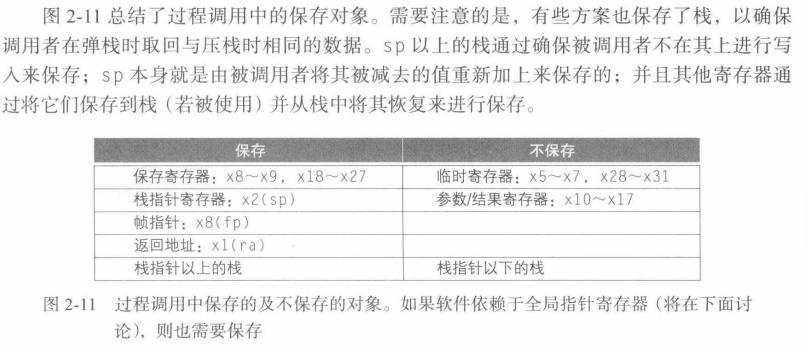
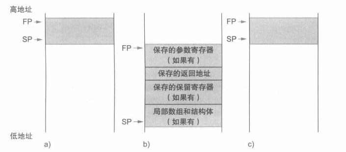

# 寄存器与堆栈

## 过程调用

过程（*Procedure*）：一个根据给定参数执行特定任务的已存储的子程序。

过程允许程序员一次只专注任务的一部分，参数可以传递数值并返回结果。在执行过程时，程序遵循以下六步：

1. 将参数放在过程可以访问到的位置；
2. 将控制转交给过程；
2. 获取过程所需的存储资源；
2. 执行所需任务；
2. 将结果放在调用程序可以访问到的位置；
2. 将控制返回到初始点，因为过程可以从程序中多个点调用。


## 寄存器

寄存器时访问数据最快的位置，期望尽可能多的使用它。RISC-V 为过程调用分配寄存器如下：

- `x10 ~ x17`：8个参数寄存器，用于传参和返回；
- `x1`：一个返回地址寄存器，用于返回到起始点；
- `x5 ~ x7 && x28 ~ x31`：临时寄存器，不被被调用的过程保存；
- `x8 ~x9 && x18 ~ x27`：保存寄存器，在过程调用中必须被保存。
- RISC-V 还包括一个用于过程的**跳转-链接指令**`jal`：跳转到某个地址的同时将下一条指令保存到目标寄存器`rd`（通常为`x1`）。

```assembly
jal  x1, ProcedureAddr
```

> 假如：对于一个过程，编译器需要比8个参数寄存器更多的寄存器，调用者所需的所有寄存器需要**换出**到存储器内，其理想结构为**栈**（*stack*）。


## 栈 stack

**栈**（*stack*）是一种后进先出的队列。栈需要一个指向栈中最新分配地址的指针，来指示将寄存器值换出的位置。在 RISC-V 中，**栈指针**（*stack point*）时寄存器`x2`，也称`sp`。

- 压栈：放入数据；
- 弹栈：移除数据；
- 地址顺序：从高地址向低地址增长。

现在要编译一个C过程体：

```cpp
long long int lead_example (long long int g,
                           long long int h,
                           long long int i,
                           long long int j)
{
    long long int f;
    f = (g + h) - (i + j);
    return f;
}
// x10 <- g
// x11 <- h
// x12 <- i
// x13 <- j
// x20 <- f
```

编译后：

```assembly
leaf_example:
	addi sp, sp, -24    ; 栈创建 3 个双字空间: 3 * 8 = 24 Byte
	sd   x5, 16(sp)     ; 保存临时寄存器 x5 的值到栈
	sd   x6, 8(sp)      ; 保存临时寄存器 x6 的值到栈
	sd   x20, 0(sp)     ; 保存临时寄存器 x20 的值到栈
	; 以下三条语句对应过程体
	add  x5, x10, x11   ; reg x5 = g + h
	add  x6, x12, x13   ; reg x6 = i + j
	add  x20, x5, x6    ; f = reg x20 = x5 - x6
	; 为了返回 f 值，将其复制到一个参数寄存器中
	addi x10, x20, 0    ; 返回: reg x10 = f + 0
	; 返回之前，通过栈中弹出数据恢复寄存器三个旧值
	ld   x20, 0(sp)     ; 从栈中取出寄存器的值 reg x20 = sp[0]
	ld   x6, 8(sp)      ; 从栈中取出寄存器的值 reg x6 = sp[1]
	ld   x5, 16(sp)     ; 从栈中取出寄存器的值 reg x5 = sp[2]
	addi sp, sp, 24     ; 栈释放 3 个双字空间
	jalr x0, 0(x1)      ; 分支返回 x1 起始点
```

> 在上述例子中，由于调用者不希望在过程中保存寄存器`x5`和`x6`，可以在代码中去掉两次存储和载入。


## 嵌套

不调用其他过程的过程称为**叶子过程**（*Leaf Procedure*）。如果调用自己时，同样的寄存器会有使用冲突，一个解决方法时将其他所有必须保存的寄存器压栈。调整栈指针`sp`以计算压栈寄存器的数量，返回时从寄存器中恢复寄存器并重新调整栈指针。

现在要编译一个递归的C过程：

```cpp
long long int fact (long long int n)
{
    if (n < 1) return (1);
    else return (n * fact(n - 1));
}
// x10 <- n
// x0 <- 0
```

编译后：

```assembly
fact:
	addi sp, sp, -16      ; 栈创建 2 个双字空间: 2 * 8 = 16 Byte
	sd   x1, 8(sp)        ; 保存临时寄存器 x1 = old_addr 的值到栈
	sd   x10, 0(sp)       ; 保存 x10 = n 到栈
	; 第一次调用 fact 时，sd 保存程序中调用 fact 的地址
	; 下面两条指令测试 n 是否小于 1 ，如果 n >= 1 则跳转到 L1
	addi x5, x10, -1      ; reg x5 = n - 1
	bge  x5, x0, L1       ; if (n - 1) >= 0 goto L1
	; 如果 n < 1，fact 将 1 放入一个值寄存器并返回 1，即 fact(1)
	addi x10, x0, 1       ; reg x10 = 0 + 1
	addi sp, sp, 16       ; 释放栈指针空间
	jalr x0, 0(x1)        ; 分支返回 x1 起始点
L1:
	addi x10, x10, -1     ; 如果 n >= 1, reg x10 = n - 1
	jal  x1, fact         ; 使用 x10 的值调用 fact(n - 1), x1 = new_addr
	addi x6, x10, 0       ; reg x6 = fact(n - 1)
	ld   x10, 0(sp)       ; 从栈中取出寄存器的值 reg x10 = sp[0] = n
	ld   x1, 8(sp)        ; 从栈中取出寄存器的值 reg x1 = sp[1] = old_addr
	addi sp, sp, 16       ; 栈删除 2 个双字空间
	mul  x10, x10, x6     ; reg x10 = n * fact(n - 1)
	jalr x0, 0(x1)        ; 分支返回 x1 起始点
```

为了简化静态数据的访问，一些 RISC-V 编译器保留一个寄存器`x3`用作全局指针（*Global Pointer*）或者`gp`：指向静态数据区的保存寄存器。



栈同时也用于存储过程的**局部变量**，但这些变量不适用于寄存器（如：局部数组或结构体）。栈中包含过程所保存的寄存器值和局部变量的段称为**过程帧或活动记录**，图中展示了过程调用前、调用期间、调用后的栈状态。



一些 RISC-V 编译器使用**帧指针**`fp`或者寄存器`x8`来指向过程帧的第一个双字。


## 堆 heap


