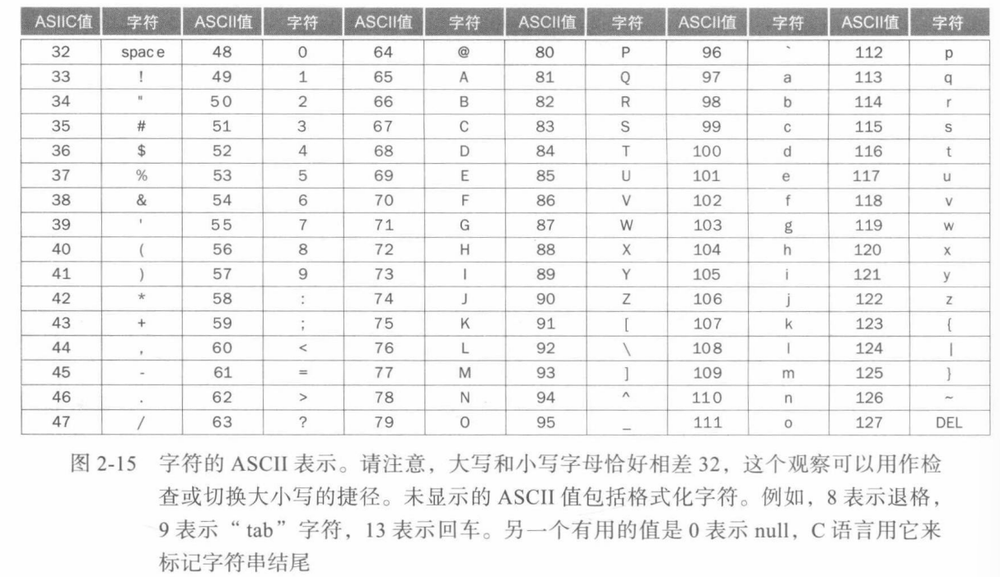

# ASCII 人机交互

ASCII（*American Standard Code for Information Interchange*）是每个人用来遵循的字符表示方法：




## 字节转移指令

**加载无符号字节指令**`lbu`：从内存中加载一个字节，将其放在寄存器最右边8位。

**存储字节指令**`sb`：从寄存器的最右边8位取一个字节将其写入内存。

复制一个字节的顺序如下：

```assembly
lbu  x12, 0(x10)    ; 读取源字节到寄存器
sb   x12, 0(x11)    ; 写入字节到内存中
```


字符串通常有三种表示：

1. 字符串第一个位置保留，用于给出字符串长度；
2. 附加带有字符串长度的变量（如结构体）；
3. 字符串最后位置用一个字符标记结尾。

C语言使用第三种选择，使用值为 0 的字节表示终止字符串


