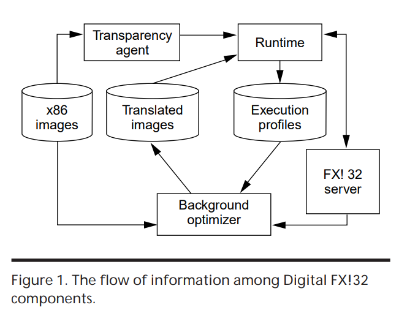
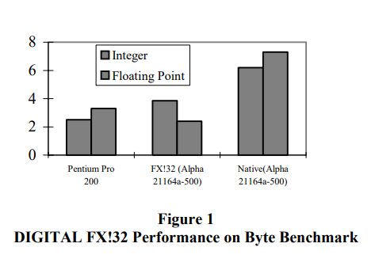

# FX!32

>参考资料：
>
>1. [FX!32 - Wikipedia](https://en.wikipedia.org/wiki/FX!32)
>2. [FX!32 Paper](https://web.stanford.edu/class/cs343/resources/fx32.pdf)
>3. [Running 32-Bit x86 Applications on Alpha NT](https://www.usenix.org/legacy/publications/library/proceedings/usenix-nt97/full_papers/chernoff/chernoff.pdf)
>4. [虚拟机与二进制翻译技术拾遗 | 黎明灰烬 博客](https://zhenhuaw.me/blog/2019/revisiting-vitrual-machine-and-dynamic-compiling.html)

FX!32 是一个商业仿真软件，允许 Intel x86 的 Win32 程序运行在基于 DEC Alpha 的 Windows NT 的系统上（1997）。

- 开发公司：Digital Equipment Corporation
- 开发时间：1997
- 指令集翻译：x86 -> Alpha
- 关键词：剖析（Profile）、透明（Transparent）启动和加载

> "透明的启动和加载"是指：
>
> 在用户使用应用程序时，他们不需要知道或理解应用程序是如何在他们的系统上启动和加载的。这个过程对用户来说是"透明"的，也就是说，他们可以像在原生环境中一样自然地运行应用程序，而无需进行任何特殊的操作或设置。

## FX!32 组成

DIGITAL FX!32的软件组成模块主要包括以下几部分：

1. **模拟器**（Emulator）：模拟器负责执行x86代码，这包括在应用程序被翻译之前或无法翻译的部分。模拟器还会生成执行剖析数据，供翻译器使用。
2. **翻译器**（Binary Translater & Opt）：翻译器在后台运行，根据剖析数据将x86代码翻译成Alpha代码。翻译后的代码可以提高应用程序的性能，达到与原x86平台相当的水平；
3. **代理和运行时**（Agent & Runtime）：代理提供透明的启动和加载x86程序的功能。运行时会重定位x86 image，并为系统调用的代码提供helper函数；
4. **数据库和服务器**（Database & Server）：数据库存储 Profile 和翻译 Image，以及应用程序的配置信息。服务器负责维护数据库和调度翻译过程。

## 执行过程

DIGITAL FX!32的程序执行过程如下：

1. **启动和加载**（Load images）：当用户启动一个x86的32位程序时，FX!32的 Agent 开始透明的启动和加载过程。Runtime 会重定位x86镜像；
2. **模拟执行**（Emulate exec）：在应用程序被翻译之前或无法翻译的部分，使用模拟器来执行x86代码。这个过程可能会比在原生x86系统上运行慢一些，但是它允许任何x86的32位程序在Alpha系统上运行；
3. **剖析和翻译**（Profile & Translate）：模拟器在执行x86代码的同时，会生成执行剖析数据。这些数据会被送到后台的翻译器。翻译器根据剖析数据将x86代码翻译成Alpha代码。这个过程在在后台进行；
4. **优化执行**（Opt exec）：当翻译后的Alpha代码可用时，运行时会使用这些代码替换原来的x86代码。因为Alpha代码的执行效率更高，所以应用程序的性能会得到提升；
5. **数据库和服务器**（Database & Server）：所有的 Profile 和翻译后的 Image 都会被存储在数据库中，以便于下次执行时使用。服务器负责维护数据库和调度翻译过程。当有新的剖析数据生成时，服务器会更新数据库，并根据新的数据调度翻译过程。当有新的翻译 Image 生成时，服务器也会更新数据库，并确保下次执行时使用最新的翻译 Image。

> 备注：这里的 Image 类似于 Code Block

## 数据库

DIGITAL FX!32的数据库存储了以下数据的条目和细节（本质上是 DLL 文件）：

1. **镜像索引**（Image ID）：Guest Image Entry 经过 hash 函数生成索引；
2. **剖析数据**（Profile）：模拟器在执行x86代码的同时，会生成执行剖析数据。这些数据包括了程序的运行情况：
   1. **SPC-TPC 地址对**：x86 code entry -> Alpha code entry 地址对
   2. **未对齐引用的指令地址**：一些指令地址未对齐，需要二次取指；
   3. **CALL 指令目标地址**：使用 CALL 指令调用的指令块地址；
   4. （个人设想）**Image 执行次数**
3. **翻译镜像**（Translated Image）：翻译器将x86代码翻译成Alpha代码后，会将翻译后的代码存储在数据库中。这些翻译后的代码被称为翻译镜像。当同一个程序再次运行时，系统可以直接使用这些翻译镜像，而无需再次进行翻译，从而提高了程序的启动速度和运行效率。
4. **镜像重定位 section**：包含 x86 image 引用的重定位信息的部分（如果 x86 image 未在其首选基地址加载则必须重新定位这些引用；

## Profile

每当模拟相关指令时，通过将值插入运行时哈希表来收集 Profile。例如：

1. 当模拟 CALL 指令时，模拟器会记录调用的目标；
2. 当卸载 Image 或应用程序退出时，将处理运行时维护的哈希表，并写入该 Image 的 Profile；
3. 于此同时，运行时判断如果该 Image 是热点代码，将会调用翻译器；
4. Server 将翻译后的 Image  和 Profile 进行处理，传入数据库；
5. 如果非热点代码，Server 处理此 Profile，将其与任何先前的 Profile 合并。

## 实验表现

