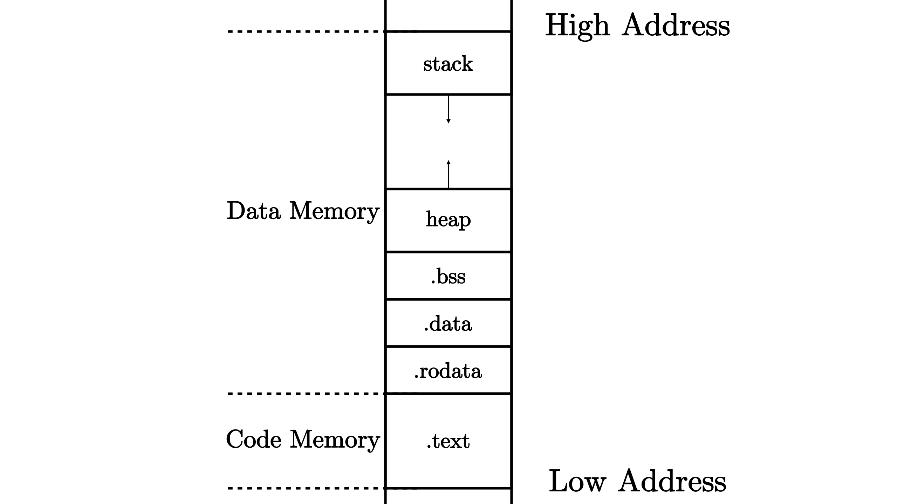
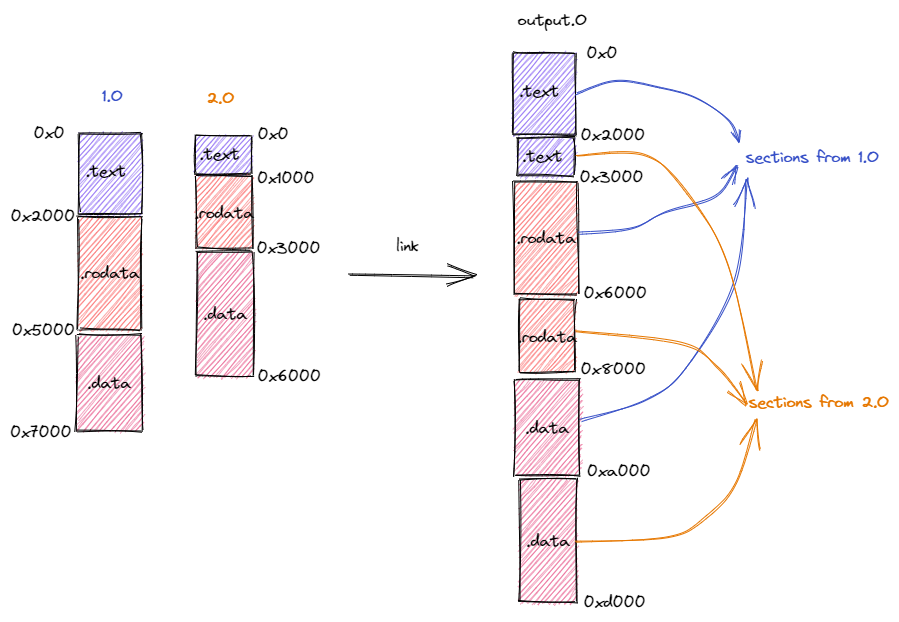

# ELF 文件加载解析

## 程序内存布局

将源码（*source code*）编译为 ELF 文件后，其变成一个看似充满杂乱无章字节的文件。但可以将其分为**程序**（*Program*）和**数据**（*Data*）两部分：

1. **程序**：由一条条能被解码（*Decode*）的指令组成；
2. **数据**：存放着被程序控制读写的数据；

事实上，还能将文件划分为更小的单位：**段**（*Section*）。不同的段被放置在内存不同的位置上，这构成了程序的**内存布局**（*Memory Layout*），一种典型的程序相对内存布局如下：

代码段：`.text`（存放所有程序）

数据段：

- `.rodata`：（已初始化）只读的全局数据，常数、常量字符串；
- `.data`：（已初始化）可修改的全局数据；
- `.bss`：（未初始化）全局数据，由程序加载器（*Loader*）代为清零；
- 堆（*heap*）：用来存放程序运行时动态分配的数据，向高地址增长，如：`new`，`melloc`；
- 栈（*stack*）：用作函数调用上下文保存与恢复，每个函数的局部变量被编译器放于栈帧，向低地址增长。

> 函数视角上，能访问的变量：
>
> 1. 函数入参和局部变量：保存在寄存器或函数栈帧内；
> 2. 全局变量：保存在`.data`和`.bss`，通过寄存器`gp(x3)+offset`来访问
> 3. 堆上的动态变量：运行时分配指针来访问，该指针可作为局部变量（栈帧）也可作为全局变量。

## 编译流程

编译主要有三个流程：

1. **编译器** (*Compiler*) 将每个源文件从某门高级编程语言转化为汇编语言，注意此时源文件仍然是一个 ASCII 或其他编码的文本文件；
2. **汇编器** (*Assembler*) 将上一步的每个源文件中的文本格式的指令转化为机器码，得到一个二进制的 **目标文件** (*Object File*)；
3. **链接器** (*Linker*) 将上一步得到的所有目标文件以及一些可能的外部目标文件链接在一起形成一个完整的可执行文件。

链接器所做的事情是将所有输入的目标文件整合成一个**整体的内存布局**。在此期间链接器主要完成两件事情：

1. 将来自不同目标文件的段在目标内存布局中重新排布。如下图所示，在链接过程中，分别来自于目标文件 `1.o` 和 `2.o` 段被按照段的功能进行分类，相同功能的段被排在一起放在拼装后的目标文件 `output.o` 中。注意到，目标文件 `1.o` 和 `2.o` 的内存布局是存在冲突的，同一个地址在不同的内存布局中存放不同的内容。而在合并后的内存布局中，这些冲突被消除；
2. 将符号替换为具体地址。

> 备注：
>
> 1. 这里的**符号**（*Symbol*）指什么呢？
>
> 我们知道，在我们进行模块化编程的时候，每个模块都会提供一些向其他模块公开的全局变量、函数等供其他模块访问，也会访问其他模块向它公开的内容。要访问一个变量或者调用一个函数，在源代码级别我们只需知道它们的名字即可，这些名字被我们称为符号。取决于符号来自于模块内部还是其他模块，我们还可以进一步将符号分成内部符号和外部符号。
>
> 然而，在机器码级别（也即在目标文件或可执行文件中）我们并不是通过符号来找到索引我们想要访问的变量或函数，而是直接通过变量或函数的地址。例如，如果想调用一个函数，那么在指令的机器码中我们可以找到函数入口的绝对地址或者相对于当前 PC 的相对地址。
>
> 2. 那么，符号何时被替换为具体地址呢？
>
> 因为符号对应的变量或函数都是放在某个段里面的固定位置（如全局变量往往放在 `.bss` 或者 `.data` 段中，而函数则放在 `.text` 段中），所以我们**需要等待符号所在的段确定了它们在内存布局中的位置之后**才能知道它们确切的地址。
>
> 当一个模块被转化为目标文件之后，它的内部符号就已经在目标文件中被转化为具体的地址了，因为目标文件给出了模块的内存布局，也就意味着模块内的各个段的位置已经被确定了。**然而，此时模块所用到的外部符号的地址无法确定。**我们需要将这些外部符号记录下来，放在目标文件一个名为符号表（Symbol table）的区域内。由于后续可能还需要重定位，内部符号也同样需要被记录在符号表中。
>
> 外部符号需要等到链接的时候才能被转化为具体地址。假设模块 1 用到了模块 2 提供的内容，当两个模块的目标文件**链接到一起的时候，它们的内存布局会被合并，也就意味着两个模块的各个段的位置均被确定下来**。此时，模块 1 用到的来自模块 2 的外部符号可以被转化为具体地址。
>
> 同时我们还需要注意：两个模块的段在合并后的内存布局中被重新排布，其最终的位置有可能和它们在模块自身的局部内存布局中的位置相比已经发生了变化。因此，每个模块的内部符号的地址也有可能会发生变化，我们也需要进行修正。上面的过程被称为**重定位**（*Relocation*）。
>
> 这个过程形象一些来说很像拼图：由于模块 1 用到了模块 2 的内容，因此二者分别相当于一块凹进和凸出一部分的拼图，正因如此我们可以将它们无缝地拼接到一起。

## ELF 头信息

**端序或尾序**（*Endianness*），又称字节顺序。在计算机科学领域中，指电脑内存中或在数字通信链路中，多字节组成的字（*Word*）的字节（*Byte*）的排列顺序。字节的排列方式有两个通用规则:例如，将一个多位数的低位放在较小的地址处，高位放在较大的地址处，则称小端序（*little-endian*）；反之则称大端序（*big-endian*）。常见的 x86、RISC-V 等架构采用的是小端序。

