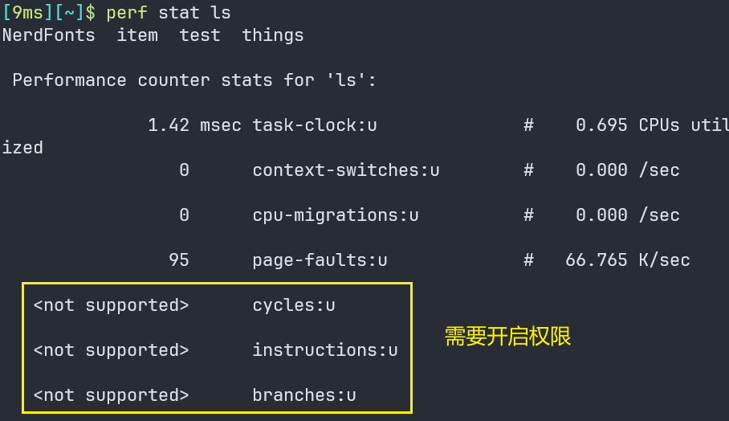
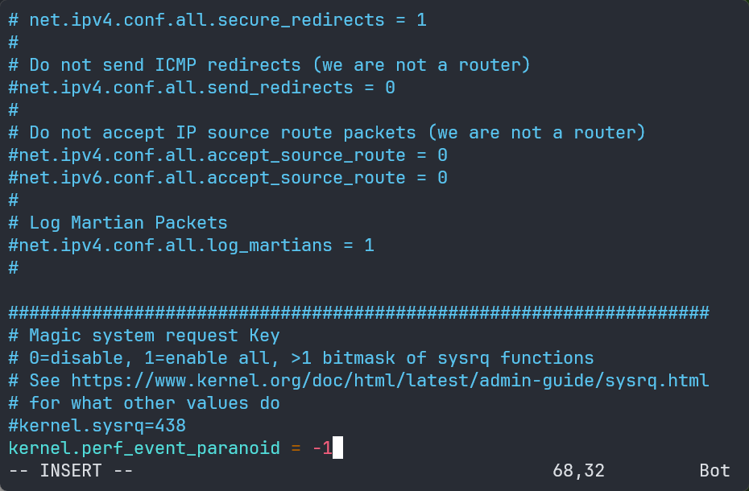
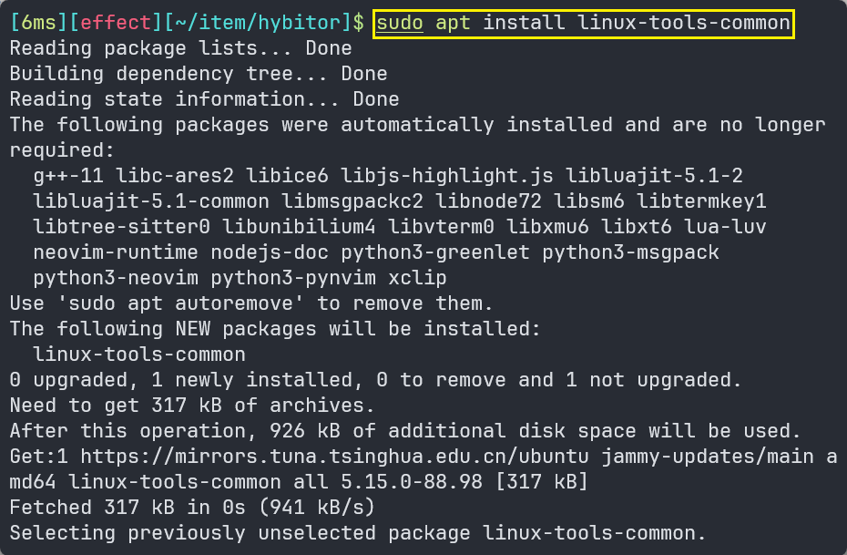
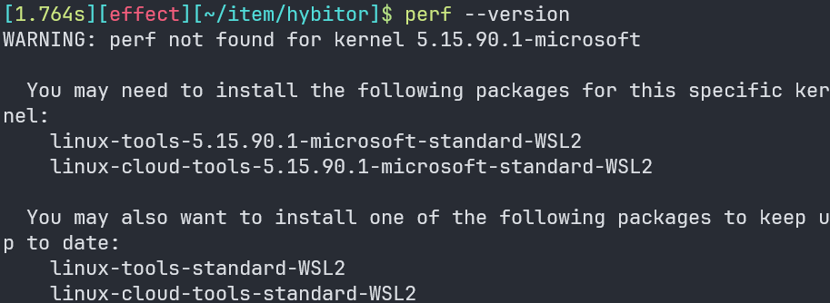
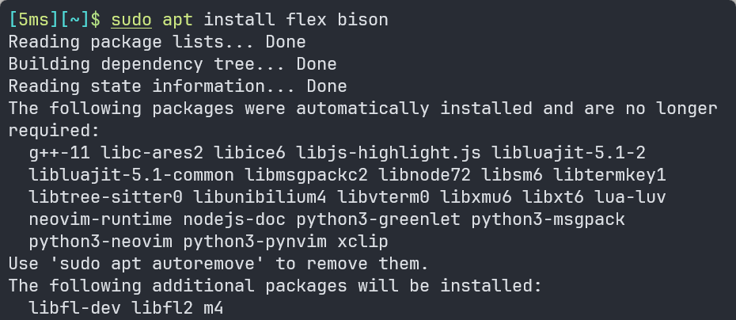
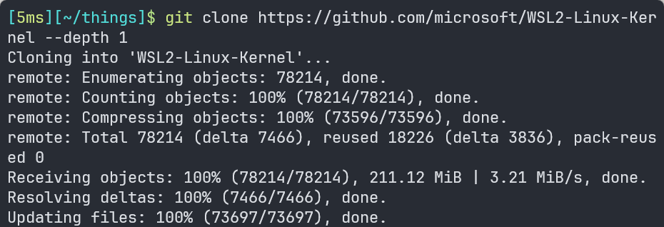
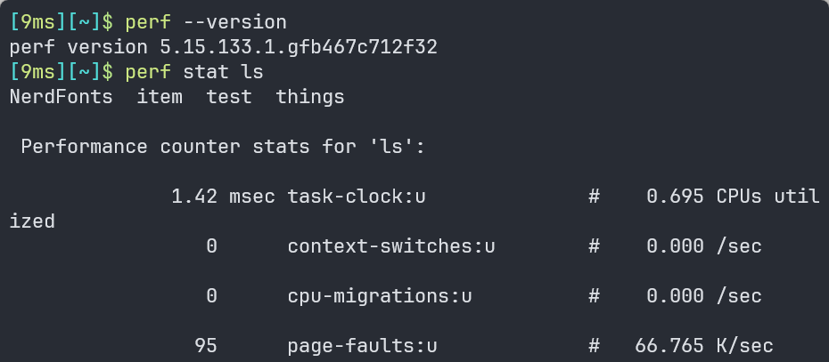

# Perf 安装

> 参考资料：
>
> - [在WSL2中使用perf性能剖析工具](https://zhuanlan.zhihu.com/p/600483539)
> - [虚拟机Linux使用perf stat提示cycles not supported](https://www.cnblogs.com/azureology/p/13913540.html)
> - [13代酷睿下Vmware无法开启虚拟化CPU性能计数器](https://www.zhihu.com/question/597146155)
> - [Perf tools support for Intel® Processor Trace - Perf Wiki --- 性能工具对英特尔®处理器跟踪的支持](https://perf.wiki.kernel.org/index.php/Perf_tools_support_for_Intel®_Processor_Trace)


---

## Linux 安装 perf

1. 在线安装`perf`，先获取Linux内核源码：

```bash
sudo apt-get update
sudo apt-get install linux-tools-common
```

2. 安装`linux-tools`获取`perf`：

```
sudo apt-get install linux-tools-$(uname -r)
```

3. 安装完毕后，可以使用 `perf stat` 命令来进行性能分析。例如：查看`ls`命令 CPU 使用情况：

```bash
sudo perf stat ls
```


---

## perf 开启权限

1. 使用`perf`时部分性能指标未开启：



2. 修改`sudo vim /etc/sysctl.conf`：

```
kernel.perf_event_paranoid = -1
```



3. `sudo sysctl -p`更新配置文件，查看更新后的值判断是否为-1：

```Bash
sudo sysctl -p
cat /proc/sys/kernel/perf_event_paranoid
```


## Vmware 中的 perf 问题

虚拟机中`perf stat`如果无法测量`cycles`和`branches`，有如下可能：

1. 这一款cpu不支持虚拟计数器（例如：13代 Intel`VMPC`启动失败）；

2. cpu支持虚拟计数器，但虚拟机未开启功能，关闭VMware虚拟机电源，找到硬件配置选项中CPU勾选：虚拟化cpu性能计数器，重启虚拟机。


---

## WSL2 下安装 perf

1. 安装Linux实用工具：

```bash
sudo apt install linux-tools-common
```




2. 查看perf版本：

```bash
perf --verison
```




3. 安装依赖：

```bash
sudo apt install flex bison
```




4. 下载WSL2内核并编译，复制编译好的perf程序：

```
git clone https://github.com/microsoft/WSL2-Linux-Kernel --depth 1
cd WSL2-Linux-Kernel/tools/perf
make -j8
sudo cp perf /usr/local/bin
```



