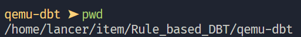
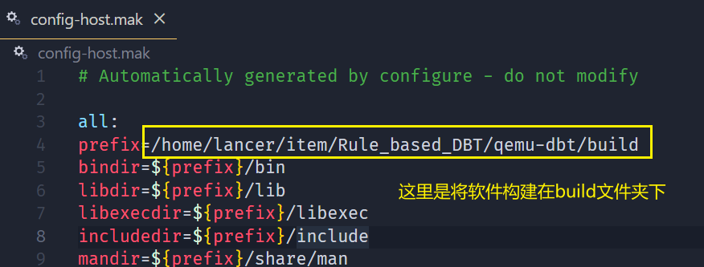
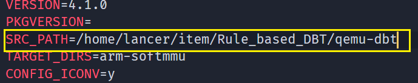

# Rule Based DBT 项目分析

> 参考资料：
>
> 1. [fudan-ppi/Rule_based_DBT](https://github.com/fudan-ppi/Rule_based_DBT)
> 2. [基于学习的动态二进制翻译方法](https://ppi.fudan.edu.cn/c0/cf/c36730a442575/page.htm)


## 环境部署

从 github 下载项目：

```shell
git clone https://github.com/fudan-ppi/Rule_based_DBT.git
```

进入`qemu-dbt`文件夹，使用`pwd`查看绝对路径：

```shell
cd ./Rule_based_DBT/qemu-dbt
mkdir build
pwd
```



修改`config-host.mak`文件：

```makefile
prefix=[Your Path]/build
...
SRC_PATH=[Your Path]
```






## 构建错误


报错1：

```
/home/lancer/item/Rule_based_DBT/qemu-dbt/slirp/src/slirp.h:29:10: fatal error: sys/uio.h: No such file or directory
   29 | #include <sys/uio.h>
      |          ^~~~~~~~~~~
compilation terminated.
make[1]: *** [Makefile:44: /home/lancer/item/Rule_based_DBT/qemu-dbt/slirp/src/arp_table.o] Error 1
make[1]: Leaving directory '/home/lancer/item/Rule_based_DBT/qemu-dbt/slirp'
make: *** [Makefile:503: slirp/all] Error 2
```


