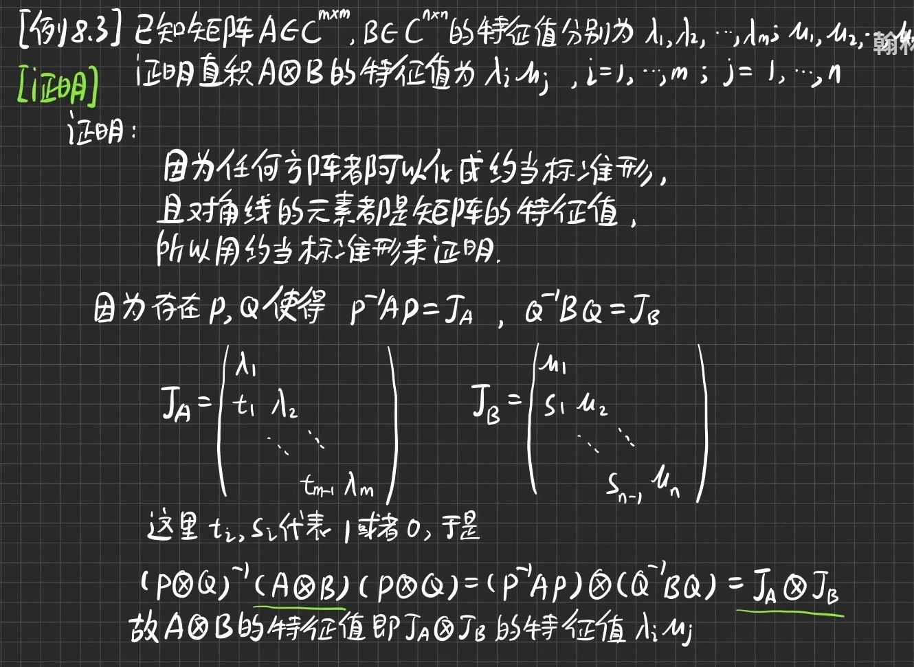
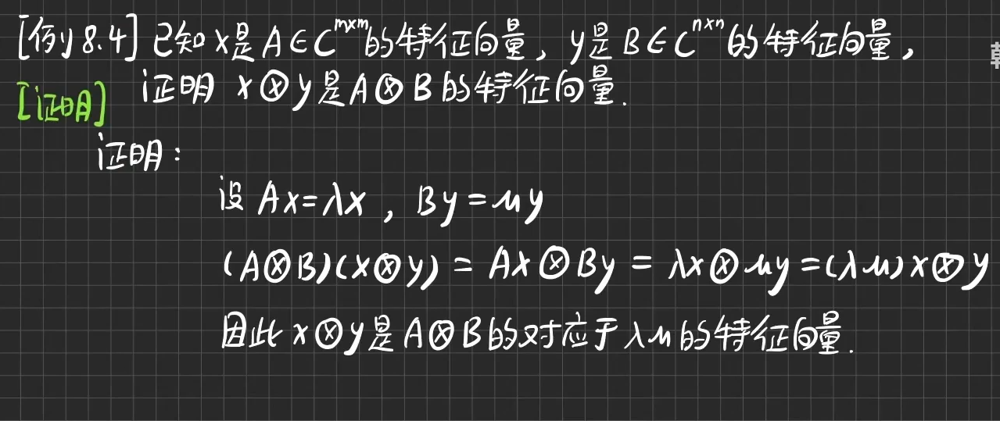

# 矩阵分析复习

## 一、题目类型与分值

1. 计算解 (4小题) ，共45分;
2. 问题求解题 (2小题) ，共25分;
3. 证明题 (3小题) ，共30分

## 二、复习提纲

1. 矩阵的Hadamard积和Kronecker 积

Jordan标准型

2. 矩阵的迹

3. 求实矩阵函数的 Jacobian 矩阵和梯度矩阵:

4. 求矩阵 $A$ 的Moor-Penrose逆 $ A^{\dagger } $

满秩分解法

5. 求到矩阵 $A$ 列空间上的投影算子和正交投影算子

投影算子：
$$
P=AA^{\dagger }
$$
正交投影算子：
$$
I-P=I-AA^{\dagger }
$$

6. 求与A最接近的正交矩阵

考虑正交强迫一致问题：
$$
\min_{Q^TQ=I} \left \| A-BQ \right \| ^{2} _{F}
$$
化简：
$$
\left \| A-BQ \right \| ^{2} _{F}=tr(AA^T)-2tr(Q^TB^TA)+tr(Q^TB^TBQ)
$$
即求：
$$
\min_{Q^TQ=I} tr(Q^TB^TA)
$$
设 $ B^TA = U\Sigma V^T$ ，正交矩阵$ Z=V^TQ^TU $ ，则有：
$$
tr(Q^TB^TA) = tr(Q^TU\Sigma V^T) = tr(V^TQ^TU\Sigma) = tr(Z\Sigma)
$$
其中：
$$
tr(Z\Sigma)=\sum_{i=1}^{n}z_{ii}\sigma_{i} \le \sum_{i=1}^{n}\sigma_{i}
$$
当且仅当 $ z_{ii} = 1 $ 时等号成立，即 $ Z=I, Q=UV^T$ 

特例：当 $ B=I $ 时，$ Q=UV^T $ 即 $ A $ 最接近的正交矩阵。

7. 正则化非负矩阵分解的迭代法则 (加法和乘法迭代法则) :

平方 Euclidean 距离
$$
\min_{A,S} D_{E}(X||AS) = \frac{1}{2} \left \| X-AS \right \| ^2_{F}
$$
迭代公式（加法形式）：
$$
\left\{\begin{matrix}
a_{ik} \longleftarrow a_{ik} - \mu_{ik} \frac{\partial D_E(X || AS)}{\partial a_{ik}} 
 \\s_{kj} \longleftarrow s_{kj} - \eta_{kj} \frac{\partial D_E(X || AS)}{\partial s_{kj}} 

\end{matrix}\right.
$$

其中：
$$
\left\{\begin{matrix}
\frac{\partial D_E(X || AS)}{\partial A} = -(X-AS)S^T
 \\\frac{\partial D_E(X || AS)}{\partial S} = -A^T(X-AS)

\end{matrix}\right.
$$
则可以化简为乘法形式，令：
$$
\left\{\begin{matrix}
\mu_{ik}=\frac{a_{ik}}{[ASS^T]_{ik}} 
 \\\eta_{kj}=\frac{s_{kj}}{[A^TAS]_{kj}} 

\end{matrix}\right.
$$

乘法形式：
$$
\left\{\begin{matrix}
a_{ik} \longleftarrow a_{ik} \frac{[XS^T]_{ik}}{[ASS^T]_{ik}}
\\ s_{kj} \longleftarrow s_{kj} \frac{[A^TX]_{kj}}{[A^TAS]_{kj}}
\end{matrix}\right.
$$
K-L 散度

8. $ L_1 $ 正则化最小二乘问题解的充要条件;

$ L_1 $ 正则化最小二乘问题：
$$
minJ(\lambda, x) = \frac{1}{2} \left \| y-Ax \right \| _{2} ^{2} + \lambda \left \| x \right \| _{1}
$$
次梯度向量：
$$
\nabla_x J(\lambda, x) = -A^{T}(y-Ax) + \lambda \nabla_x \left \| x \right \|  _{1}
$$

设 $ c = A^{T}(y-Ax) $，则 $L_1$ 正则化最小二乘问题的平稳条件（充要条件）：
$$
c = \lambda \nabla_x \left \| x \right \|  _{1}
$$

其中：
$$
\nabla_{x_{i}}  \left \| x \right \|  _{1} =
\left\{\begin{matrix}
\{+1\} \qquad \quad x_{i} > 0
 \\\left [ -1, +1 \right ] \qquad x_{i} = 0
 \\\{-1\} \qquad \quad x_{i} < 0
\end{matrix}\right.
$$
即：
$$
c_i=
\left\{\begin{matrix}
\{+\lambda\} \qquad \quad x_{i} > 0
 \\\left [ -\lambda, +\lambda \right ] \qquad x_{i} = 0
 \\\{-\lambda\} \qquad \quad x_{i} < 0
\end{matrix}\right.
$$

9. Rayleigh商和广义Rayleigh商的最小化或最大化问题的解:

Hermitian 矩阵 $ A $ 的 Rayleigh 商为：
$$
R(A,x)=\frac{x^HAx}{x^Hx}
$$
将最小二乘问题简化，令 $ x^Hx=1 $ ，此时 $ R(A,x)=x^HAx $

构造Lagrange乘子函数 $ L(x,\lambda) = x^HAx - \lambda (x^Hx-1) $

对 $ x $ 求梯度并令其为 $0$ ，得到 $ 2Ax - 2\lambda x =0 $

等价于 $ \lambda_{i} $ 为矩阵 $A $ 第 $ i $ 个特征值，$ x_i $ 为其特征向量，故：
$$
R(A,x_i)=\lambda_i
$$
得到结论：当取 $A $ 的最大特征向量 $ x_{max} $ 时，Rayleigh 商有最大值即为 $ \lambda_{max} $ ；同理取 $A $ 的最小特征向量 $x_{min}$ 时，Rayleigh 商有最小值即为 $ \lambda_{min} $

广义 Rayleigh 商中，如果 $B$ 为正定矩阵：
$$
R(A,B,x)=\frac{x^HAx}{x^HBx}
$$
设新的向量 $ \tilde{x}=B^{1/2}x $ ，代入得：
$$
R(A,\tilde{x})=\frac{\tilde{x}^H(B^{-1/2})^HAB^{-1/2}\tilde{x}}{\tilde{x}^H\tilde{x}}
$$
故矩阵对 $(A,B)$ 的广义 Rayleigh 商即为 $ (B^{-1/2})^HAB^{-1/2}$ 的标准 Rayleigh 商

若 $ (B^{-1/2})^HAB^{-1/2} $ 的特征值分解为：
$$
(B^{-1/2})^HAB^{-1/2}\tilde{x}=\lambda \tilde{x}
\\ B^{-1}Ax=\lambda x
\\ Ax=\lambda Bx
$$
此表明矩阵 $ (B^{-1/2})^HAB^{-1/2}$  的特征值分解与矩阵对 $(A,B)$ 的广义特征分解等价。故 $ x$ 取矩阵对 $(A,B)$ 的广义特征值对应的最大特征向量时，广义 Rayleigh 商最大化。

10. 实对称矩阵或Hermitian矩阵的特征值必为实数

[证明 Hermitian 矩阵特征值均为实数，属于不同特征值的特征向量正交](https://www.zhihu.com/question/447501623)

一、原式子：
$$
Ax=\lambda x
$$
两边取共轭转置：
$$
x^HA^H=\bar{\lambda} x^H
$$
两边右乘 $x$ ：
$$
x^HA^Hx=\bar{\lambda}x^Hx
\\ x^HAx=\bar{\lambda}x^Hx
\\ \lambda x^Hx=\bar{\lambda} x^Hx
$$
$x$ 非0向量，则 $ \lambda - \bar{\lambda} = 0$ ，故 Hermitian 矩阵的特征值必为实数

二、证明正定矩阵的特征值都大于0

原式子：
$$
Ax=\lambda x
\\ x^TAx=\lambda x^Tx
$$
由于 $ x^TAx > 0 $，又有 $x$ 非0向量，$ x^Tx >0 $

故：
$$
\lambda =\frac{x^TAx}{x^Tx} > 0
$$
得证

11. 总体最小二乘问题的解。

